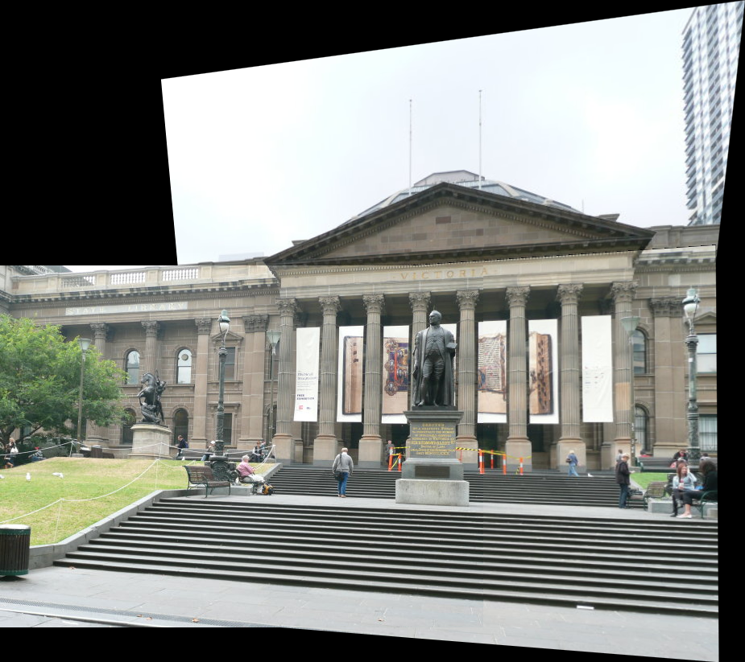

# Panorama Stitching

A Python/OpenCV-based system for building high-quality panoramas from a sequence of images.  
Key steps include Harris+ANMS corner detection, ratio-test matching + RANSAC homography, cumulative warping into a common frame, and ROI-limited Poisson blending.

